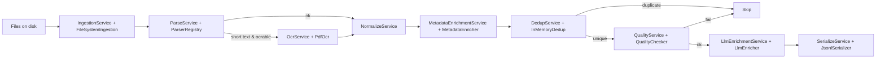

# Habithon Preprocessing

Document preprocessing pipeline: ingestion → parsing (TXT/PDF/DOCX/MSG/IMAGE) → optional OCR → normalization → metadata enrichment → deduplication → quality → JSONL serialization.

## Install

From the monorepo root (or the `src/preprocessing` dir):

```bash
# Base (no heavy deps)
pip install ./src/preprocessing

# With optional parser deps
pip install './src/preprocessing[parsers]'

# With OCR + image deps (requires system binaries; see below)
pip install './src/preprocessing[ocr]'

# With charset detection helpers
pip install './src/preprocessing[encoding]'

# Everything
pip install './src/preprocessing[all]'
```

### System dependencies (OCR)

- Tesseract OCR binary
- Poppler (for `pdf2image`) – required to rasterize PDFs

macOS (Homebrew):

```bash
brew install tesseract poppler
```

Ubuntu/Debian:

```bash
sudo apt-get update && sudo apt-get install -y tesseract-ocr poppler-utils
```

## CLI

A small CLI is provided via the `preprocessing` console script.

```bash
# Batch preprocess a directory into JSONL (LLM enrichment is mandatory)
preprocessing preprocess INPUT_DIR --out output.jsonl \
  --ocr            # enable OCR for PDFs/images (optional) \
  --globs "**/*.pdf" --globs "**/*.txt"   # override file patterns (optional)

# Parse a single file and print a brief JSON summary
preprocessing parse-file /path/to/file.pdf
```

Notes:
- OCR requires `tesseract`, `poppler` and Python packages from the `ocr` extra.
- Parsers for PDF/DOCX/MSG require the `parsers` extra.
- OPENAI_API_KEY must be set in your environment (or .env) for the CLI to run.

## Python API

```python
from pathlib import Path
from datetime import datetime
from preprocessing.adapters import Container
from preprocessing.app import IngestionService
from preprocessing.adapters.ingestion.file_system import FileSystemIngestion
from preprocessing.settings import Settings

# Load settings once (loads .env if present)
settings = Settings.load()

# Build a default pipeline that writes JSONL
pipe = Container.default_pipeline(Path("out.jsonl"), settings=settings, enable_ocr=False)

# Ingest a batch of files and process them
ing = IngestionService(FileSystemIngestion())
docs = ing.ingest_batch(Path("/data"), ("**/*.txt", "**/*.pdf"))
stats = pipe.process_many(docs)
print(stats)

# Always close the serializer when done
pipe._serialize.close()
```

## Features

- Ingestion: filesystem batch scan and simple async watch
- Parsers: TXT, PDF (pdfminer), DOCX (python-docx), MSG (extract_msg), images (with inline OCR best-effort)
- OCR: Tesseract via `pdf2image` + `pytesseract`
- Normalization: whitespace collapse, NFKC, simple header/footer stripping
- Enrichment: language/token/length heuristics; LLM summaries/keywords (mandatory)
- Dedup: in-memory store
- Quality: simple thresholds + metrics
- Serialization: JSON Lines output

## Workflow

High-level pipeline for one document:

1) Ingestion: discover files via FileSystemIngestion (batch or watch)
2) Parse: ParserRegistry selects a parser by extension (Txt/Pdf/Docx/Msg/Image)
3) OCR (optional): OcrService runs PdfOcr when text is too short for pdf/png/jpg
4) Normalize: NormalizeService collapses whitespace, applies NFKC, strips headers
5) Metadata: MetadataEnricher adds language/hash/token counts and basic stats
6) Deduplicate: DedupService checks content hash (InMemoryDedup by default)
7) Quality: QualityService evaluates length thresholds and metrics
8) LLM: LlmEnrichmentService adds summary and keywords (run halts on LLM failure)
9) Serialize: JsonlSerializer appends one JSON record per line

Flow (optional diagram):



Batch vs watch:
- Batch: IngestionService.ingest_batch(root, globs) yields RawDocument for matching files.
- Watch: IngestionService.ingest_watch(...) streams new/modified files (adapter uses polling).

Record schema (JSONL):
- text: string
- source: { path, size, mtime, ext, meta }
- charset: optional string
- language: optional string
- hash: optional string (content hash)
- tokens: optional int
- metadata: object (parser/ocr/enrichment/llm flags and stats)

## Troubleshooting

- If OCR text is empty, verify `tesseract` and `poppler` are installed and on PATH.
- For PDFs that fail to rasterize, try `pdftoppm -v` to confirm Poppler is available.
- On Windows, install Tesseract from the official installer and configure environment variables accordingly.
- If you see "OPENAI_API_KEY is required but not set", define it in your shell or put it in a .env file.

## License

MIT
